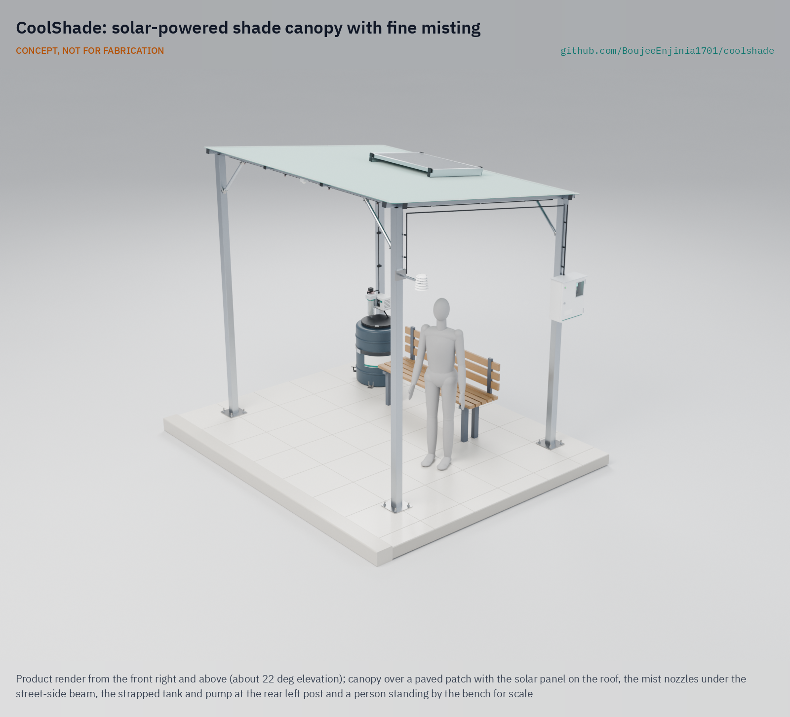
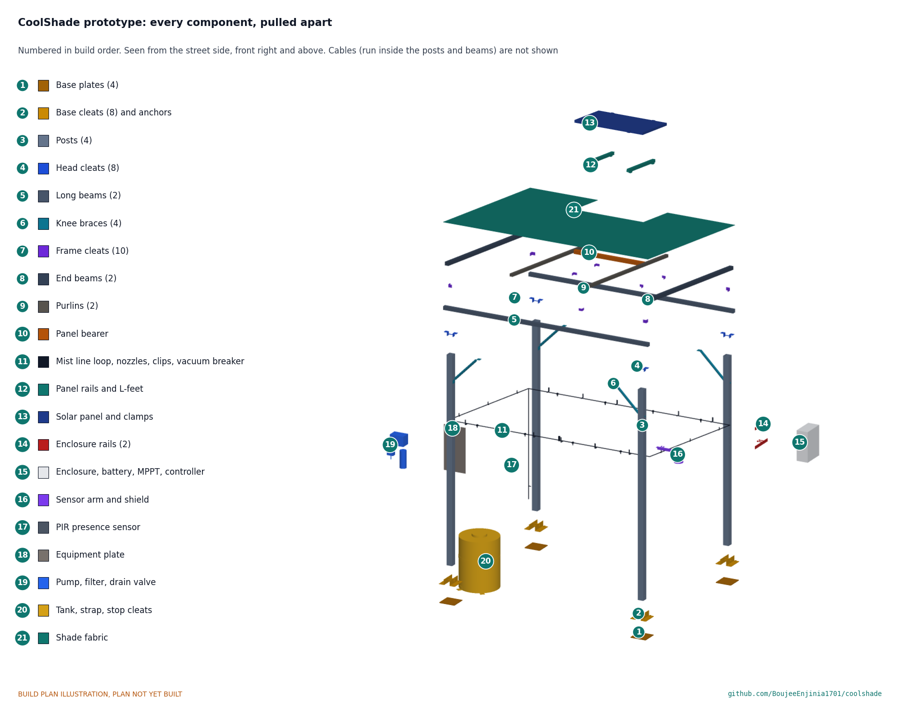

# CoolShade

     

**Area:** Smart Cities · **TRL:** 3 of 9 (proof of concept on paper) · **Prototype budget:** about $775 USD (parts now $882; a new budget is proposed) · **Difficulty:** 3 of 5

A solar-powered shade canopy with fine misting for bus stops, markets and queues, switching on only when heat stress is high.

[Prototype build plan](docs/05-build-plan.md) · [Design decisions](docs/06-design-decisions.md) · [Exploded render](media/render-exploded.png) · [Detail render](media/render-detail.png) · [Interactive 3D model](media/viewer.html) · [Concept blueprint (PDF)](media/concept-blueprint.pdf) · [General arrangement (PDF)](cad/drawings/CSH-DWG-001.pdf) · [Sizing calculations](docs/04-calcs/01-sizing.md) · [Review note](docs/REVIEW.md)

## Concept rationale

For a person waiting in the sun, radiant heat from the sun and hot pavement matters as much as air temperature, and shade removes most of it: in Tempe, Arizona, even shade sails cut the daytime mean radiant temperature by about 17 °C ([Middel et al., 2021](https://journals.ametsoc.org/view/journals/bams/102/9/BAMS-D-20-0193.1.xml)). CoolShade therefore starts with shade and adds low-pressure misting only when it helps: when the air is hot and dry enough for evaporation to cool it and someone is actually waiting. Gating on humidity and presence keeps water and energy use low (85 L and about 204 Wh on a hot, dry day, from the TRL 3 calculations) and avoids wetting people in humid air.

It is open and garage-buildable because the places that need it most, curbside stops, informal markets and distribution queues, rarely have power, budgets or staff for commercial misting systems. The frame is bolted steel tube, the roof is shade cloth, and the power and water parts are generic 12 V solar, pump and irrigation parts. Cities, schools and community groups can build, move, repair and audit it, including the water hygiene plan that any public misting system needs.

## Burning platform

WHO estimates about 489,000 heat-related deaths each year between 2000 and 2019, 45 % of them in Asia and 36 % in Europe, and notes that informal settlements are often hotter than other urban areas ([WHO](https://www.who.int/news-room/fact-sheets/detail/climate-change-heat-and-health)). In one summer, 2022, an estimated 61,672 people died of heat across 35 European countries ([Ballester et al., *Nature Medicine*, 2023](https://www.nature.com/articles/s41591-023-02419-z)).

Heat also takes work time from people who spend their day outdoors: the ILO projects that 2.2 % of total working hours worldwide will be lost to higher temperatures by 2030, equivalent to 80 million full-time jobs ([ILO, 2019](https://www.ilo.org/global/about-the-ilo/newsroom/news/WCMS_711917/lang--en/index.htm)). Cooling centers help people who can reach them, but many people are exposed where they must wait: at bus stops, in market lanes and in queues.

## Where it could be used

### By industry

| Industry | Use |
| --- | --- |
| Public transit | Shade and misting at busy unsheltered bus and minibus stops, and at terminals with long waits |
| Municipal markets | Cooled waiting and trading spots in open-air and informal markets during the midday peak |
| Public health and humanitarian response | Relief at clinic, vaccination, food and water distribution queues and at camp service points |
| Education | Shade at school gates, playgrounds and pickup areas |
| Construction and outdoor work | Shaded, cooled rest points near sites, with water use logged |
| Events and tourism | Queues at venues, heritage sites and festivals in hot seasons |

### By country or region

| Country or region | Why it matters there |
| --- | --- |
| United States | In all but 6 of the 175 largest urbanized areas, the average person of color lives in a census tract with higher surface urban heat island intensity than non-Hispanic white residents ([Hsu et al., 2021](https://www.nature.com/articles/s41467-021-22799-5)); transit riders in these areas wait in the heat |
| Europe | About 61,672 heat-related deaths in summer 2022 across 35 countries ([Ballester et al., 2023](https://www.nature.com/articles/s41591-023-02419-z)); shade for waiting places in dense cities has to be added without new buildings |
| India | An assessment of 37 city, district and state heat action plans found that vulnerable groups are rarely identified or targeted ([CPR, 2023](https://cprindia.org/briefsreports/how-is-india-adapting-to-heatwaves-an-assessment-of-heat-action-plans-with-insights-for-transformative-climate-action/)); low-cost shade at markets and stops is a practical measure such plans can fund |
| Sub-Saharan Africa | Africa warmed by about 0.3 °C per decade over 1991 to 2022 ([WMO](https://wmo.int/news/media-centre/africa-suffers-disproportionately-from-climate-change)); open-air markets and minibus ranks are central to daily life and shade, power and piped water cannot be assumed there |
| North Africa and the Middle East | WMO reports warming has been most intense in North Africa, with extreme heat in 2022 ([WMO](https://wmo.int/news/media-centre/africa-suffers-disproportionately-from-climate-change)); dry air there suits evaporative misting well |

## What sparked the idea

The idea traces back to Expo '92 in Seville, where the midday summer heat would have made the open public spaces unlivable without the site's designed microclimate. Its designers combined three measures: shading to block the sun, cold surfaces of vegetation and water, and cold air made by micronizing water in the passage areas where visitors walked and queued ([Castro Medina et al., *Sustainability*, 2022](https://doi.org/10.3390/su142114173)). That system served a showcase site with mains power, piped water and staff on hand. CoolShade takes the same order, shade first and mist second, and asks whether it can fit in a bolted canopy that runs from a panel and a tank at an ordinary bus stop or market lane, with the humidity and presence gating and the hygiene routine that an unattended public site needs.

## Problem

People waiting outdoors in extreme heat have nowhere to cool down, and public cooling is rarely where they wait. Full problem statement: [docs/01-problem.md](docs/01-problem.md).

## Concept

A four-post bolted steel canopy, 3.0 x 2.4 m, on a 2.8 x 2.35 m post grid, with a knitted shade cloth roof laced over the frame, a 100 W solar panel and a 12.8 V LiFePO4 battery. A 12 V diaphragm pump sends filtered water from a 120 L tank at about 7 bar to eight anti-drip nozzles under the roof beams. The controller mists only when the air is 32 °C or more, relative humidity is 60 % or less and a passive infrared sensor sees someone waiting; a normally open valve drains the line after every session. No camera or microphone is fitted.

TRL 3 calculations ([CSH-CAL-001](docs/04-calcs/01-sizing.md)): about 17 °C lower mean radiant temperature from the shade (from published shade sail measurements), 2.71 °C lower air temperature while spraying at 1 m/s wind (1.35 °C averaged over the spray cycle), 85 L of water and 204 Wh per hot, dry day, a 25 Ah battery lasting 1.26 days without sun, one tank lasting 1.41 days, headroom of 2,223 mm, and $882 in parts against the $775 budget once every part needed to build it is counted (a $925 budget is proposed, awaiting Amish). The frame and anchors are sized to survive a 30 m/s gust with the fabric removed; the fabric goes on only when forecast gusts are below 15 m/s (54 km/h), because its edge pull would overload the roof beams in a storm. One requirement is not met on paper: cost (R13), until the budget is decided. At risk: *Legionella* control in warm stored water and nozzle scaling; wetting cannot be judged until droplet data are in hand. Design decisions: [CSH-DDR-001](docs/decisions/0001-trl2-review-decisions.md), [CSH-DDR-002](docs/decisions/0002-recommendations-accepted.md) and [CSH-DDR-003](docs/decisions/0003-design-for-construction.md) (design for construction), indexed in the [design decisions register](docs/06-design-decisions.md).

Full design precis: [docs/02-concept.md](docs/02-concept.md). Requirements: [docs/03-requirements.md](docs/03-requirements.md).

## Key components

1. Posts, 80 x 80 mm galvanized steel, with knee braces
2. Roof frame, 50 x 50 mm steel, joined by angle cleats and rivet nuts
3. Shade fabric, knitted HDPE
4. Base plates, base cleats and anchors
5. Solar panel, 100 W, on rails at the roof's rear edge
6. LiFePO4 battery, 12.8 V 25 Ah
7. MPPT charge controller
8. Controller in a lockable IP65 enclosure
9. Sensor head: temperature and humidity in a radiation shield, PIR presence sensor
10. Misting pump, 12 V, about 7 bar, on an equipment plate
11. Filter, 5 µm, and check valve
12. Mist line loop with 8 anti-drip nozzles
13. Water tank, 120 L, opaque, strapped, with a low-level switch
14. Normally open drain valve and vacuum breaker
15. Hose and wiring harness

The priced bill of materials is in [bom/bom.csv](bom/bom.csv). The parametric model is [cad/src/model.py](cad/src/model.py), with STEP and STL exports in `cad/step/` and `cad/stl/`; `python cad/src/model.py --check` runs its constructability checks.

## Building the prototype

The prototype build plan ([docs/05-build-plan.md](docs/05-build-plan.md), CSH-BLD-001) shows, in pictures drawn from the model, how to make each of the canopy's steel parts and how to put the whole prototype together in 17 steps. Every joint is bolted: angle cleats join the tubes, bolts into the closed beams go into rivet nuts, and there is no welding. Making the design buildable changed some of the concept (posts moved out to carry the cloth's edges, the panel moved to the rear edge on its own bearer, and more); the changes are in [CSH-DDR-003](docs/decisions/0003-design-for-construction.md), and decisions still open are in the [design decisions register](docs/06-design-decisions.md). It is a plan, not yet built.

## Safety

> Misting makes an aerosol. *Legionella* grows in water at 20 to 50 °C and infects people who breathe in contaminated mist ([WHO](https://www.who.int/news-room/fact-sheets/detail/legionellosis)). Use potable water only, keep the tank opaque and shaded, drain the line after every session, flush the tank daily and disinfect it weekly, and stop misting if the water is not maintained. Misting is ineffective in high humidity; the controller must switch off then.
>
> Lithium cells can overheat, vent and burn. Use protected cells or LiFePO4, fuse every pack, charge only within the cell maker's limits and never leave a first build charging unattended.
>
> The canopy is a wind-loaded structure: anchor it to a checked slab or footing, strap the tank, fit the fabric only when forecast gusts are below 15 m/s, and remove it before storms. Building it is work at height with heavy steel. The pump line runs at about 7 bar; depressurize it before opening fittings. Install on public land only with the asset owner's permission.

## Repository layout

| Folder | Contents |
| --- | --- |
| `docs/` | Problem, concept, requirements, calculations and design decisions |
| `cad/src/` | build123d Python source, the source of truth for all geometry |
| `cad/step/`, `cad/stl/` | Exported models for FreeCAD, other CAD tools and printing |
| `cad/drawings/` | 2D sketches and dimensioned drawings |
| `bom/` | Bill of materials |
| `electronics/` | KiCad schematics and PCB layouts |
| `firmware/` | Microcontroller code |
| `media/` | Renders, perspectives and photos |
| `build-log/` | Dated prototyping notes |

## Documentation

Controlled documents follow the portfolio [documentation standard](.kit/STANDARDS.md). Each carries a document ID (CSH-PRC-001 for the precis), a version and a revision history. Branded PDFs are built with `python .kit/render.py` and attached to GitHub Releases when a document is tagged, for example `CSH-PRC-001/v1.0`.

## Credits

Designed by Amish Chadha. See [CONTRIBUTORS.md](CONTRIBUTORS.md) for roles. To cite this design, use [CITATION.cff](CITATION.cff) (GitHub shows it as "Cite this repository").

AI assistance (Claude) was used to accelerate concept renders, prototype documentation and first-pass sizing calculations. Design direction and all decisions are Amish Chadha's, recorded in this repository's decision records (`docs/decisions/`).

## Licenses

- **Hardware** (CAD, drawings, BOM, electronics): [CERN-OHL-S v2](LICENSE)
- **Software** (firmware, scripts, notebooks): [MIT](LICENSE-SOFTWARE)

A project of the [Design Molecule](https://designmolecule.com) lab.
