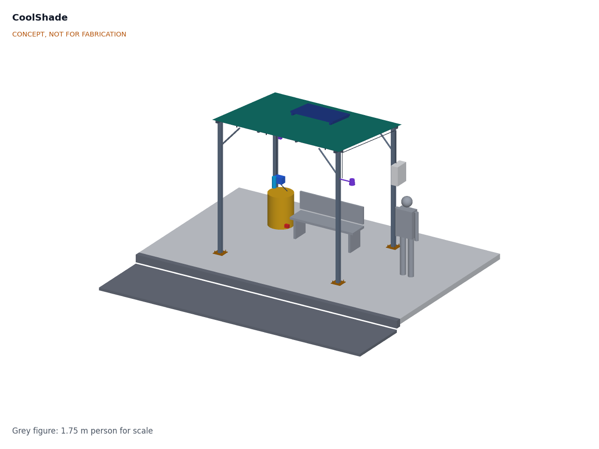

# CoolShade

  

**Area:** Smart Cities · **TRL:** 2 of 9 (concept formulated) · **Prototype budget:** about $700 USD · **Difficulty:** 3 of 5

A solar-powered shade canopy with fine misting for bus stops, markets and queues, switching on only when heat stress is high.

[Interactive 3D model](media/viewer.html) · [Concept blueprint (PDF)](media/concept-blueprint.pdf) · [Review note](docs/REVIEW.md)

## Concept rationale

For a person waiting in the sun, radiant heat from the sun and hot pavement matters as much as air temperature, and shade removes most of it: in Tempe, Arizona, even shade sails cut the daytime mean radiant temperature by about 17 °C ([Middel et al., 2021](https://journals.ametsoc.org/view/journals/bams/102/9/BAMS-D-20-0193.1.xml)). CoolShade therefore starts with shade and adds low-pressure misting only when it helps: when the air is hot and dry enough for evaporation to cool it and someone is actually waiting. Gating on humidity and presence keeps water and energy use low (about 85 L and 205 Wh on a hot, dry day, estimates) and avoids wetting people in humid air.

It is open and garage-buildable because the places that need it most, curbside stops, informal markets and distribution queues, rarely have power, budgets or staff for commercial misting systems. The frame is bolted steel tube, the roof is shade cloth, and the power and water parts are generic 12 V solar, pump and irrigation parts. Cities, schools and community groups can build, move, repair and audit it, including the water hygiene plan that any public misting system needs.

## Burning platform

WHO estimates about 489,000 heat-related deaths each year between 2000 and 2019, 45 % of them in Asia and 36 % in Europe, and notes that informal settlements are often hotter than other urban areas ([WHO](https://www.who.int/news-room/fact-sheets/detail/climate-change-heat-and-health)). In one summer, 2022, an estimated 61,672 people died of heat across 35 European countries ([Ballester et al., *Nature Medicine*, 2023](https://www.nature.com/articles/s41591-023-02419-z)).

Heat also takes work time from people who spend their day outdoors: the ILO projects that 2.2 % of total working hours worldwide will be lost to higher temperatures by 2030, equivalent to 80 million full-time jobs ([ILO, 2019](https://www.ilo.org/global/about-the-ilo/newsroom/news/WCMS_711917/lang--en/index.htm)). Cooling centers help people who can reach them, but many people are exposed where they must wait: at bus stops, in market lanes and in queues.

## Where it could be used

### By industry

| Industry | Use |
| --- | --- |
| Public transit | Shade and misting at busy unsheltered bus and minibus stops, and at terminals with long waits |
| Municipal markets | Cooled waiting and trading spots in open-air and informal markets during the midday peak |
| Public health and humanitarian response | Relief at clinic, vaccination, food and water distribution queues and at camp service points |
| Education | Shade at school gates, playgrounds and pickup areas |
| Construction and outdoor work | Shaded, cooled rest points near sites, with water use logged |
| Events and tourism | Queues at venues, heritage sites and festivals in hot seasons |

### By country or region

| Country or region | Why it matters there |
| --- | --- |
| United States | In all but 6 of the 175 largest urbanized areas, the average person of color lives in a census tract with higher surface urban heat island intensity than non-Hispanic white residents ([Hsu et al., 2021](https://www.nature.com/articles/s41467-021-22799-5)); transit riders in these areas wait in the heat |
| Europe | About 61,672 heat-related deaths in summer 2022 across 35 countries ([Ballester et al., 2023](https://www.nature.com/articles/s41591-023-02419-z)); shade for waiting places in dense cities has to be added without new buildings |
| India | An assessment of 37 city, district and state heat action plans found that vulnerable groups are rarely identified or targeted ([CPR, 2023](https://cprindia.org/briefsreports/how-is-india-adapting-to-heatwaves-an-assessment-of-heat-action-plans-with-insights-for-transformative-climate-action/)); low-cost shade at markets and stops is a practical measure such plans can fund |
| Sub-Saharan Africa | Africa warmed by about 0.3 °C per decade over 1991 to 2022 ([WMO](https://wmo.int/news/media-centre/africa-suffers-disproportionately-from-climate-change)); open-air markets and minibus ranks are central to daily life and shade, power and piped water cannot be assumed there |
| North Africa and the Middle East | WMO reports warming has been most intense in North Africa, with extreme heat in 2022 ([WMO](https://wmo.int/news/media-centre/africa-suffers-disproportionately-from-climate-change)); dry air there suits evaporative misting well |

## What sparked the idea

It came out of a September 2026 review of Design Molecule's applied research areas against the open projects already in the lab. It pairs with HeatMap Node. The real-world trigger is the evidence that simple shade sharply reduces the heat a person feels ([Middel et al., 2021](https://journals.ametsoc.org/view/journals/bams/102/9/BAMS-D-20-0193.1.xml)), while summers such as Europe's in 2022 still kill tens of thousands of people ([Ballester et al., 2023](https://www.nature.com/articles/s41591-023-02419-z)).

## Problem

People waiting outdoors in extreme heat have nowhere to cool down, and public cooling is rarely where they wait. Full problem statement: [docs/01-problem.md](docs/01-problem.md).

## Concept

A four-post bolted steel canopy, 3.0 x 2.4 m, with a knitted shade cloth roof, a 100 W solar panel and a 12.8 V LiFePO4 battery. A 12 V diaphragm pump sends filtered water from a 120 L tank at about 7 bar to eight anti-drip nozzles under the roof beams. The controller mists only when the air is 32 °C or more, relative humidity is 60 % or less and a passive infrared sensor sees someone waiting (thresholds proposed); a normally open valve drains the line after every session. No camera or microphone is fitted.

First-order estimates (to be checked at TRL 3): about 17 °C lower mean radiant temperature from the shade (from published shade sail measurements), about 1.4 °C lower air temperature on average at 1 m/s wind (about 2.7 °C while spraying), about 85 L of water and 205 Wh per hot, dry day, one tank lasting about 1.4 days, and about $735 in parts. Not met: the $700 budget and the 2 °C air cooling target at 1 m/s wind. At risk: wetting from low-pressure droplets, *Legionella* control in warm stored water, and nozzle scaling in hard water.

Full design precis: [docs/02-concept.md](docs/02-concept.md). Requirements: [docs/03-requirements.md](docs/03-requirements.md).

## Key components

1. Posts, 80 x 80 mm galvanized steel, with knee braces
2. Roof frame, 50 x 50 mm steel
3. Shade fabric, knitted HDPE
4. Base plates and anchors
5. Solar panel, 100 W
6. LiFePO4 battery, 12.8 V 20 Ah
7. MPPT charge controller
8. Controller in a lockable IP65 enclosure
9. Sensor head: temperature and humidity in a radiation shield, PIR presence sensor
10. Misting pump, 12 V, about 7 bar
11. Filter, 5 µm, and check valve
12. Mist line with 8 anti-drip nozzles
13. Water tank, 120 L, opaque
14. Normally open drain valve
15. Hose and wiring harness

The working bill of materials is in [bom/bom.csv](bom/bom.csv).

## Safety

> Misting makes an aerosol. *Legionella* grows in water at 20 to 50 °C and infects people who breathe in contaminated mist ([WHO](https://www.who.int/news-room/fact-sheets/detail/legionellosis)). Use potable water only, keep the tank opaque and shaded, drain the line after every session, flush the tank daily and disinfect it weekly, and stop misting if the water is not maintained. Misting is ineffective in high humidity; the controller must switch off then.
>
> Lithium cells can overheat, vent and burn. Use protected cells or LiFePO4, fuse every pack, charge only within the cell maker's limits and never leave a first build charging unattended.
>
> The canopy is a wind-loaded structure: anchor it to a checked slab or footing and remove the fabric before storms. Building it is work at height with heavy steel. The pump line runs at about 7 bar; depressurize it before opening fittings. Install on public land only with the asset owner's permission.

## Repository layout

| Folder | Contents |
| --- | --- |
| `docs/` | Problem, concept, requirements, calculations and design decisions |
| `cad/src/` | build123d Python source, the source of truth for all geometry |
| `cad/step/`, `cad/stl/` | Exported models for FreeCAD, other CAD tools and printing |
| `cad/drawings/` | 2D sketches and dimensioned drawings |
| `bom/` | Bill of materials |
| `electronics/` | KiCad schematics and PCB layouts |
| `firmware/` | Microcontroller code |
| `media/` | Renders, perspectives and photos |
| `build-log/` | Dated prototyping notes |

## Documentation

Controlled documents follow the portfolio [documentation standard](.kit/STANDARDS.md). Each carries a document ID (CSH-PRC-001 for the precis), a version and a revision history. Branded PDFs are built with `python .kit/render.py` and attached to GitHub Releases when a document is tagged, for example `CSH-PRC-001/v1.0`.

## Licenses

- **Hardware** (CAD, drawings, BOM, electronics): [CERN-OHL-S v2](LICENSE)
- **Software** (firmware, scripts, notebooks): [MIT](LICENSE-SOFTWARE)

A project of the [Design Molecule](https://designmolecule.com) lab. Smart cities set.
