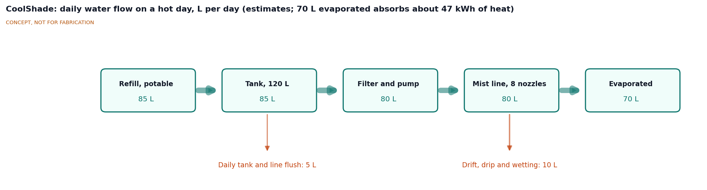
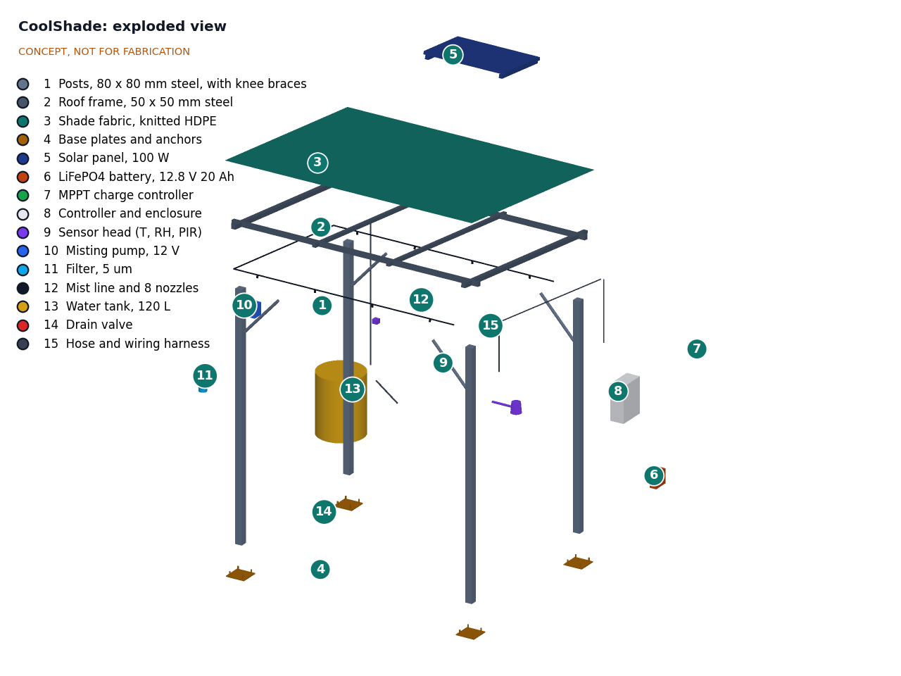
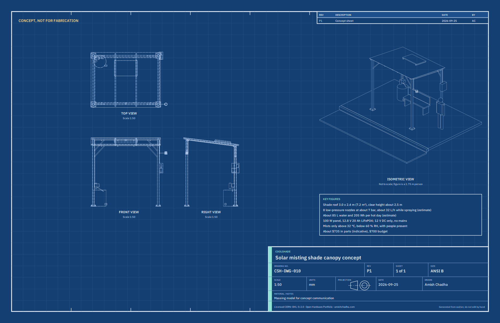

# CoolShade design precis

## Summary

CoolShade is a bolted steel shade canopy, 3.0 x 2.4 m in plan, with a knitted shade cloth roof, a 100 W solar panel, a 12 V battery and a low-pressure misting line. It gives shade all day and mists only when the air is hot and dry enough for misting to help and a person is waiting. First-order estimates for a hot, dry design day (38 °C, 25 % relative humidity) are about 85 L of water and about 205 Wh of electricity per day, an average air temperature drop of about 1.4 °C at 1 m/s wind (about 2.7 °C while spraying) and a drop in mean radiant temperature from the shade of about 17 °C, which is where most of the relief comes from. Parts cost about $735, about 5 % over the $700 budget.

*Figure 1. CoolShade at a curbside stop next to an existing bench, with a 1.75 m person for scale. Kit parts are colored; the street and bench are grey.*

## How it works

1. **Shade.** Four 80 mm square steel posts carry a mono-pitch roof frame (about 7°, high edge at the street) with knitted HDPE shade cloth. The cloth blocks most direct sun while letting hot air escape.
2. **Harvest and store.** A 100 W panel on rails over the rear half of the roof charges a 12.8 V, 20 Ah LiFePO4 battery through an MPPT controller. Everything runs at 12 V DC.
3. **Sense.** A temperature and humidity sensor in a radiation shield on an arm off the front post measures the ambient air outside the mist zone. A passive infrared sensor under the front beam detects whether anyone is waiting. No camera or microphone is fitted.
4. **Decide.** The controller mists only when air temperature is 32 °C or more, relative humidity is 60 % or less, someone has been detected in the last 2 min, and the tank is above its low level (thresholds proposed, awaiting Amish). In humid air it does not mist, because misting would add little cooling and wet people.
5. **Mist.** A 12 V diaphragm pump draws from a 120 L opaque tank through a 5 µm filter and pushes water at about 7 bar to eight anti-drip nozzles under the front and rear beams, in cycles of about 20 s on and 20 s off. Fine droplets evaporate and cool the air under the canopy.
6. **Drain.** When the pump stops at the end of a session, a normally open drain valve empties the line so water does not sit warm in it. The tank is flushed daily and disinfected weekly.

*Figure 2. Daily water flow on the design day, in liters. All values are estimates.*

## Main components

Numbers match the exploded view (Figure 3) and `bom/bom.csv`.

Table 1. Main components.

| # | Component | Proposed choice | Notes |
| --- | --- | --- | --- |
| 1 | Posts with knee braces | 80 x 80 x 3 mm galvanized SHS, 2.6 to 2.9 m, one tube brace each | Section to be checked for wind at TRL 3 |
| 2 | Roof frame | 50 x 50 mm SHS perimeter, two 40 x 40 mm purlins, bolted brackets | About 7° mono-pitch |
| 3 | Shade fabric | Knitted HDPE, about 90 % UV block, 3.0 x 2.4 m, corded to the frame | Removable before storms (proposed) |
| 4 | Base plates and anchors | 220 x 220 x 10 mm plates, four M16 anchors each, into an existing slab | Footing checked per site |
| 5 | Solar panel | 100 W monocrystalline on two rails | About 1,000 x 670 mm |
| 6 | Battery | 12.8 V, 20 Ah LiFePO4 with BMS and cold-charge cutoff | Inside item 8, fused |
| 7 | MPPT charge controller | 12 V, 10 A, LiFePO4 profile | Inside item 8 |
| 8 | Controller and enclosure | Lockable IP65 box on the rear right post, about 1.45 to 1.85 m high; microcontroller, pump and valve drivers, fuses | Firmware not started (TRL 4) |
| 9 | Sensor head | SHT4x-class temperature and humidity sensor in a multi-plate shield, plus a PIR presence sensor | No camera or microphone |
| 10 | Misting pump | 12 V diaphragm pump, about 7 bar, about 60 W, pressure switch | Bracketed to the rear left post |
| 11 | Filter and check valve | 5 µm cartridge, inlet strainer | Protects 0.4 mm nozzles |
| 12 | Mist line and nozzles | About 9 m of 9.5 mm (3/8 in) line, 8 brass anti-drip nozzles, about 0.4 mm | About 32 L/h while spraying (estimate) |
| 13 | Water tank | 120 L, opaque, food-grade, lockable | Optional mains float valve with backflow preventer |
| 14 | Drain valve | 12 V normally open solenoid at the low point | Empties the line after every session |
| 15 | Hose and wiring harness | Suction and delivery hose, outdoor cable, glands | |

*Figure 3. Exploded view with numbered callouts matching the BOM. Items 6 and 7 are shown out of the enclosure (item 8) that houses them.*

*Figure 4. Concept sheet CSH-DWG-010 with orthographic and isometric views and key figures.*

No cutaway is provided: the canopy is open, and the only enclosed parts (items 6 to 8) are shown in the exploded view.

## First-order numbers

All values are estimates for concept review and will be checked at TRL 3.

### Water and misting

Assumptions: eight nozzles at about 4 L/h each at about 7 bar (to be checked against nozzle datasheets), 20 s on and 20 s off while active (50 % duty), 5 h of active misting on the design day, about 87 % of sprayed water evaporating in the air, and a daily flush of about 5 L.

Table 2. Water use on the design day.

| Quantity | Estimate | Basis |
| --- | --- | --- |
| Flow while spraying | about 32 L/h | 8 x 4 L/h |
| Average flow while active | about 16 L/h | 50 % duty |
| Sprayed per day | about 80 L | 16 L/h x 5 h |
| Used per day, with flush | about 85 L | 80 + 5 L |
| Evaporated in the air | about 70 L | 87 % of 80 L |
| Tank endurance | about 1.4 design days | 120 L / 85 L |

### Cooling

Assumptions: latent heat of evaporation about 2.43 MJ/kg; air density 1.15 kg/m³ and specific heat 1,006 J/(kg K) at 35 °C; air crossing a control volume 3.0 m long and 2.0 m high at the wind speed; all evaporation within that volume.

Table 3. Cooling estimates on the design day.

| Quantity | Estimate | Basis |
| --- | --- | --- |
| Heat absorbed by evaporation, averaged | about 9.5 kW | 14 L/h evaporated x 2.43 MJ/kg |
| Heat absorbed while spraying | about 19 kW | 28 L/h evaporated |
| Air through the zone at 1 m/s | about 6.9 kg/s | 6 m² x 1 m/s x 1.15 kg/m³ |
| Air temperature drop at 1 m/s | about 1.4 °C averaged, about 2.7 °C while spraying | Q / (m x cp) |
| Air temperature drop at 0.3 m/s | about 4.5 °C averaged | Same method; wetting risk rises in still air |
| Wet-bulb limit, 38 °C and 25 % RH | about 23 °C | Stull approximation; far from the limit |
| Wet-bulb limit, 35 °C and 60 % RH | about 28.5 °C | Controller would not mist at 60 % or above |
| Humidity added at 1 m/s | about 0.6 g/kg | Small against about 10 g/kg ambient |
| Heat absorbed per day | about 47 kWh | 70 L x 2.43 MJ/kg |
| Mean radiant temperature drop from shade | about 17 °C | Shade sails in Tempe ([Middel et al., 2021](https://journals.ametsoc.org/view/journals/bams/102/9/BAMS-D-20-0193.1.xml)) |

The shade does most of the work: a 17 °C drop in mean radiant temperature matters more to a person standing in the sun than a 1 to 3 °C drop in air temperature. Misting adds a noticeable but smaller benefit, and only in dry air. This is why the controller must never mist in humid air, and why R4 is not met at 1 m/s wind. Fans would help mix the cooled air but cost energy and money; they are left as an option (see open questions).

### Energy

Table 4. Daily energy budget on the design day.

| Load or source | Estimate | Basis |
| --- | --- | --- |
| Pump | about 150 Wh | 60 W x 50 % x 5 h |
| Controller and sensors | about 30 Wh | about 1.2 W x 24 h |
| Drain valve held closed while active | about 25 Wh | 5 W x 5 h; a latching valve would save most of this |
| **Total use** | **about 205 Wh** | |
| Panel harvest | about 340 Wh | 100 W x 4.5 h x 0.75 |
| Battery usable | about 205 Wh | 256 Wh x 80 % |

The panel covers the design day with a margin of about 1.6 times, and the battery can run one full design day without sun. Misting demand peaks in sunny afternoons, when the panel is producing.

### Structure and wind

Assumptions: 30 m/s gust, air density 1.2 kg/m³, net pressure coefficient 1.2 for a mono-pitch free canopy (estimate), fabric treated as solid (conservative; knitted cloth is porous), load shared equally by the four posts acting as cantilevers without help from the knee braces.

Table 5. Wind load estimate.

| Quantity | Estimate | Basis |
| --- | --- | --- |
| Dynamic pressure | about 540 Pa | 0.5 x 1.2 x 30² |
| Force on the roof | about 4.7 kN | 540 Pa x 1.2 x 7.2 m² |
| Moment at each post base | about 3.3 kN m | 1.17 kN at about 2.8 m |
| Post bending stress, 80 x 80 x 3 SHS | about 144 MPa | Section modulus about 22,900 mm³, corner radii ignored |
| Ballast needed if not anchored | about 480 kg | Uplift of about 4.7 kN |

The unfactored post stress is about half the yield strength of common S275 or S355 structural steel, so the section looks adequate at this stage, but base anchors, connections and fatigue must be checked at TRL 3. The unit must be anchored to a slab or footing; ballast alone is impractical.

### Mass and cost

- Steel structure about 130 kg (four posts about 20 kg each); panel about 7 kg; battery about 2.5 kg; full tank about 125 kg.
- Parts about $735 (indicative, see `bom/bom.csv`), against a $700 budget.

## Key design choices

All proposed, awaiting Amish (see `docs/REVIEW.md`).

1. Low-pressure (about 7 bar) 12 V misting rather than high-pressure (about 70 bar) mains misting, so the unit runs off-grid and stays low-voltage. The trade-off is larger droplets and a higher wetting risk.
2. Humidity and presence gating, so water and energy are used only when misting helps someone.
3. Tank supply with an optional mains connection, so it can go anywhere.
4. Drain-after-use and a daily flush as the main defenses against *Legionella*.
5. Knitted shade cloth rather than a solid roof: cheaper, lighter and lets hot air escape, but it does not keep rain off.
6. Bolted, movable frame on existing slabs, so a city can trial it at a site and move it.

## Integration with other lab projects

- **HeatMap Node** measures street-level heat stress and can show where a CoolShade would help most, and whether it did.
- **FieldNode** could provide an optional LoRaWAN status link (counts and levels only). Its 6 W panel is far too small to run the pump, so CoolShade keeps its own power system. Whether to fit the link is proposed, awaiting Amish.

## Safety

> **Safety:** Misting is an aerosol, and *Legionella* grows in water at 20 to 50 °C and infects people who inhale contaminated mist ([WHO](https://www.who.int/news-room/fact-sheets/detail/legionellosis)). Use potable water only; keep the tank opaque, shaded and locked; drain the line after every session; flush the tank daily; disinfect weekly; and stop misting if the water is not maintained. A site owner must name a responsible person for water hygiene.
>
> **Safety:** The 12.8 V LiFePO4 battery can overheat and burn if shorted, damaged or charged outside its limits. Fuse it at the terminal, use a BMS with cold-charge cutoff, keep it in the ventilated, locked enclosure, and never install a damaged or wet battery.
>
> **Safety:** The pump line runs at about 7 bar. Depressurize before opening fittings, and wear eye protection when working on it.
>
> **Safety:** The canopy is a wind-loaded structure. Anchor it to a checked slab or footing, remove the fabric before forecast storms, and inspect bolts and anchors regularly. Building it is work at height with heavy steel; use two people, stable ladders and gloves, and deburr all cut edges.
>
> **Safety:** Wet surfaces can be slippery. Set nozzles and duty cycle so people and the ground stay dry; stop misting and adjust if puddles form.
>
> **Safety:** CoolShade is shade and local cooling, not a medical intervention or a cooling center. People with heat illness need medical help.

## Open questions

- [ ] Nozzle droplet size at about 7 bar and the real wetting distance (R5).
- [ ] Whether to add small 12 V fans to mix cooled air down into the waiting zone, at about 20 to 40 W extra.
- [ ] Control thresholds: fixed air temperature and humidity, or a heat index or WBGT threshold computed on the device.
- [ ] Water hygiene plan acceptable to the local health authority, including sampling.
- [ ] Hard water scaling and a descaling method (R16).
- [ ] Site anchor details on different slabs; footing option where no slab exists.
- [ ] Whether to fit a status link (FieldNode-compatible LoRaWAN) and what it reports.
- [ ] Budget: about $735 against $700 (R13).
